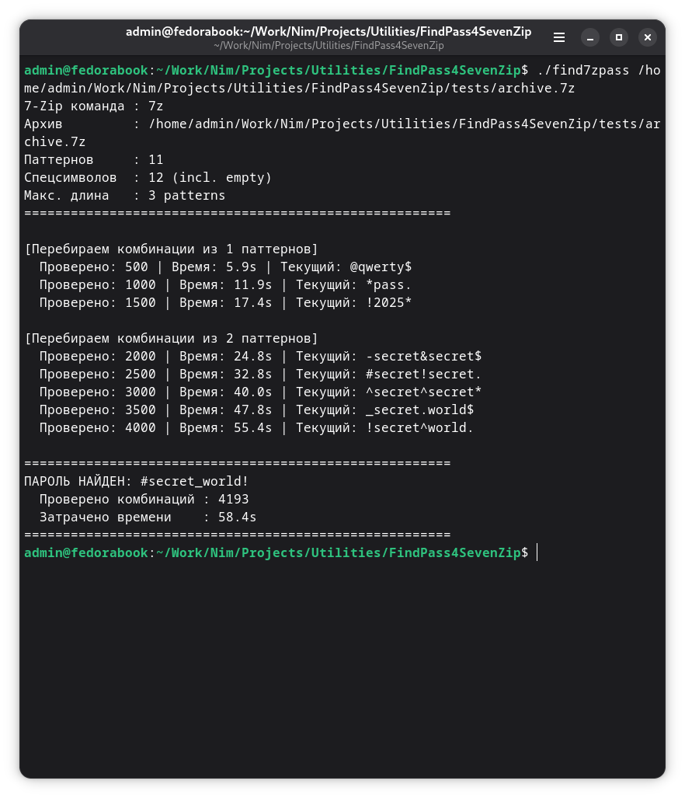

# find7zpass

A command-line utility for recovering a forgotten 7-Zip archive password by intelligently combining user-defined word fragments.

---

## Table of Contents

- [How It Works](#how-it-works)
- [Dependencies](#dependencies)
- [Compilation](#compilation)
- [Quick Start](#quick-start)
- [Project Files](#project-files)
- [Configuration File find7zpass.cfg](#configuration-file-find7zpasscfg)
- [Word List File wordlist.txt](#word-list-file-wordlisttxt)
- [Password Generation Model](#password-generation-model)
- [Estimating Candidate Count](#estimating-candidate-count)
- [Sample Output](#sample-output)
- [Tips for Building a Good Wordlist](#tips-for-building-a-good-wordlist)
- [Localization](#localization)

---

## How It Works




The program does not try every possible character combination (brute-force). Instead, it builds password candidates from meaningful fragments — **patterns** (words, dates, names) and **special characters** (punctuation, keyboard symbols) — using the following scheme:

```
[sym0] word0 [sym1] word1 [sym2] … word(N-1) [symN]
```

Each `sym` is chosen **independently** from the specials list, which covers passwords like:

```
#secret_world!
@hello-2024
pass123$
secret
_mypass_
```

For each candidate, `7z t` (archive test mode) is run. If 7-Zip returns exit code `0` — the password is found.

---

## Dependencies

| Component | Purpose | Installation |
|-----------|---------|--------------|
| [Nim](https://nim-lang.org/) ≥ 1.6 | compiler | `choosenim stable` |
| [7-Zip](https://www.7-zip.org/) | password verification | see below |

### Installing 7-Zip

**Linux (Debian/Ubuntu/Fedora):**
```bash
sudo apt install p7zip-full    # Debian/Ubuntu
sudo dnf install p7zip-plugins # Fedora
```

**Windows:** download the installer from [7-zip.org](https://www.7-zip.org/). The program will automatically locate `7z.exe` under `C:\Program Files\7-Zip\`.

**macOS:**
```bash
brew install p7zip
```

---

## Compilation

```bash
nim c -d:release find7zpass.nim
```

The `-d:release` flag enables compiler optimisations — throughput is noticeably higher than a debug build.

Output: an executable named `find7zpass` (Linux/macOS) or `find7zpass.exe` (Windows).

---

## Quick Start

1. Place `find7zpass`, `find7zpass.cfg`, and `wordlist.txt` in the same directory.
2. Edit `wordlist.txt` — add the fragments you believe the password is made of.
3. Set the archive path in `find7zpass.cfg` (the `archive` key) **or** pass it as a command-line argument:

```bash
# Linux / macOS
./find7zpass /path/to/archive.7z

# Windows
find7zpass.exe C:\path\to\archive.7z

# Use a non-default config file
./find7zpass myconfig.cfg
```

If the argument ends with `.cfg` it is treated as a config file path; otherwise it is treated as an archive path.

---

## Project Files

```
find7zpass          ← executable (after compilation)
find7zpass.nim      ← source code
find7zpass.cfg      ← settings (archive path, language, search parameters)
wordlist.txt        ← patterns and special characters
```

All four files should be in the same directory (unless absolute paths are specified in the config).

---

## Configuration File find7zpass.cfg

Format: `key = value`. Lines starting with `#` and blank lines are comments.

### Parameters

#### `archive`
Path to the 7z archive whose password you want to recover.

```ini
archive = /home/user/backup.7z
```

> A command-line argument takes priority over this setting.

**Default:** `archive.7z`

---

#### `wordlist`
Path to the file containing patterns and special characters.

```ini
wordlist = wordlist.txt
```

**Default:** `wordlist.txt`

---

#### `max_combo_len`
Maximum number of patterns in a single combination.

With a value of `3`, the program tries combinations of 1, 2, and 3 patterns (in ascending order). Repetition of patterns within a combination is allowed: `secret_secret`, `2024!2024`.

```ini
max_combo_len = 3
```

> ⚠️ Each increment causes an exponential increase in candidate count. See [Estimating Candidate Count](#estimating-candidate-count) for details.

**Default:** `3`

---

#### `progress_step`
How many checked passwords to skip between progress lines printed to the console.

```ini
progress_step = 100
```

A value of `1` prints a progress line after every check (slower due to output). A value of `500` is less frequent and produces less noise.

**Default:** `100`

---

#### `lang`
Interface language.

```ini
lang = ru   # Russian
lang = en   # English (default when set)
```

**Default:** `ru`

---

### Example find7zpass.cfg

```ini
# My config for recovering the password to a work archive

lang          = en
archive       = /home/admin/work/backup.7z
wordlist      = wordlist.txt
max_combo_len = 2
progress_step = 500
```

---

## Word List File wordlist.txt

Contains two mandatory sections. The order of sections in the file does not matter.

### File Structure

```
# This line is a comment — it is ignored

[patterns]
word1
word2
...

[specials]
<empty>
_
!
...
```

A section marker is a line of the form `[name]` with no spaces inside the brackets.
Blank lines and lines starting with `#` are ignored in both sections.

---

### Section `[patterns]`

Word fragments that the password is presumably built from: words, names, dates, numbers.

```
[patterns]
hello
world
secret
2023
2024
john
```

Each line is one pattern. Case is preserved exactly as written.

---

### Section `[specials]`

Special characters placed around and between words. Each slot is filled independently from the others.

```
[specials]
<empty>
_
-
.
!
@
<hash>
$
```

#### Escape Words

Some characters cannot be written directly in the file because they conflict with the parser syntax:

| Escape word | Actual character | Reason |
|-------------|-----------------|--------|
| `<empty>` | *(empty string)* | represents "no character at this position" |
| `<hash>` | `#` | a line starting with `#` is treated as a comment |

> **Important:** if `<empty>` is not listed explicitly, the program adds an empty string automatically. Without it, every position would be forced to contain some character, and simple passwords like `secret` or `hello_world` would never be tried.

The `<hash>` escape word works in both sections — in `[specials]` as well as in `[patterns]`.

---

### Example wordlist.txt

```
# ==========================================================
#  Word list for recovering the password to backup.7z
# ==========================================================

[patterns]
# Names and words
john
smith
backup
work

# Years
2022
2023
2024

[specials]
# Empty slot — the password may have no character here
<empty>

# Separators
_
-
.

# Symbols
!
@
<hash>
$
```

---

## Password Generation Model

For a combination of **N words** there are **N+1 slots** for special characters:

```
[sym0] word0 [sym1] word1 [sym2] … word(N-1) [symN]
```

Each `sym` is chosen **independently** from the `[specials]` section.

### Examples for N = 1 (one word)

| sym0 | word | sym1 | Result |
|------|------|------|--------|
| *(empty)* | `secret` | *(empty)* | `secret` |
| `#` | `secret` | *(empty)* | `#secret` |
| *(empty)* | `secret` | `!` | `secret!` |
| `@` | `secret` | `$` | `@secret$` |

### Examples for N = 2 (two words)

| sym0 | word0 | sym1 | word1 | sym2 | Result |
|------|-------|------|-------|------|--------|
| *(empty)* | `secret` | `_` | `world` | *(empty)* | `secret_world` |
| `#` | `secret` | `_` | `world` | `!` | `#secret_world!` |
| *(empty)* | `hello` | *(empty)* | `2024` | `!` | `hello2024!` |
| `@` | `john` | `-` | `smith` | `@` | `@john-smith@` |

### Examples for N = 3 (three words)

```
#secret_world@2023!
hello-world.2024
@pass_word_2023$
```

---

## Estimating Candidate Count

Notation: **P** = number of patterns, **S** = number of special characters (including the empty one).

For a combination of length **N** the number of candidates is:

```
P^N × S^(N+1)
```

### Table for P = 12, S = 11

| Combination length | Formula | Candidates (approx.) |
|:-----------------:|---------|---------------------:|
| 1 | 12¹ × 11² | 1,452 |
| 2 | 12² × 11³ | 190,872 |
| 3 | 12³ × 11⁴ | 25,054,704 |

At ~12 checks/sec (typical 7-Zip speed on a single core):

| Length | Time (approx.) |
|:------:|---------------|
| 1 | < 2 minutes |
| 2 | ~4 hours |
| 3 | ~24 days |

> **Conclusion:** `max_combo_len = 2` is a reasonable upper bound for most cases. Length `3` only makes sense with a very short and precise wordlist.

---

## Sample Output

```
7-Zip command : 7z
Archive       : /home/admin/archive.7z
Patterns      : 12
Specials      : 11 (incl. empty)
Max length    : 3 patterns
=======================================================

[Trying combinations of 1 patterns]
  Tested: 100 | Time: 1.2s | Current: &secret
  Tested: 200 | Time: 2.3s | Current: %world_
  ...

[Trying combinations of 2 patterns]
  Tested: 1500 | Time: 17.5s | Current: secret!secret.
  ...

=======================================================
PASSWORD FOUND: #secret_world!
  Combinations tested : 3421
  Time elapsed        : 41.3s
=======================================================
```

If the password is not found:

```
=======================================================
Password not found among 25054704 combinations
  Time elapsed        : 24d 3h
  Hint: add more patterns/specials or increase max_combo_len
=======================================================
```

To stop the search early: **Ctrl+C**.

---

## Tips for Building a Good Wordlist

**The more precise the list, the faster the result.** The program is only effective when the password is actually composed of the listed fragments.

### What to add to `[patterns]`

- The archive owner's name, nickname, pet's name
- Significant dates: birth year, year the archive was created (`2023`, `2024`)
- Favourite words, place names, hobbies
- The name of the project or service the archive relates to
- Common filler words: `pass`, `password`, `secret`, `qwerty`, `123456`

### What to add to `[specials]`

- Always include `<empty>` — many passwords contain no special characters at all
- The most common symbols: `!`, `@`, `_`, `-`, `.`
- If you know the password contains `#`, add `<hash>`
- No need to add every keyboard symbol: each additional character multiplies the candidate count by `S^(N+1)`

### Search narrowing strategy

1. Start with `max_combo_len = 1` and a short wordlist — checked in seconds.
2. If nothing found, add more patterns and try `max_combo_len = 2`.
3. Use length `3` and above only with a very short and precise list (5–10 patterns).

---

## Localization

The interface language is set by the `lang` parameter in `find7zpass.cfg`:

```ini
lang = ru   # Russian
lang = en   # English
```

If the config file is missing or inaccessible, the error message is printed in **both** languages simultaneously — before the language could be determined.

To add a new language in the source code:
1. Add a value to the `Lang` enum.
2. Declare a `Messages` constant with the translated strings.
3. Add a `of langXx: return XX` branch to the `getMsg()` function.
